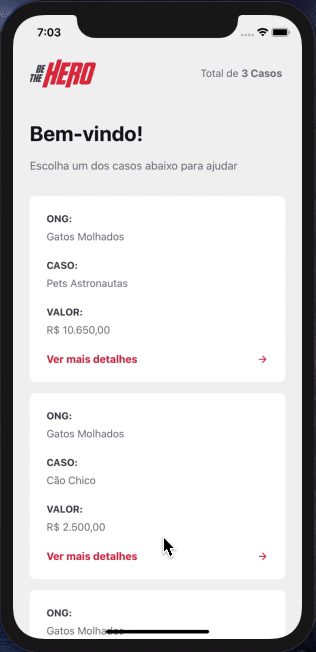

<h1 align="center">
    
</h1>

<h4 align="center">
  Projeto da Semana OmniStack 11 🚀 
</h4>

  
  
  

  

  <a href="#projeto-">Projeto</a>&nbsp;&nbsp;&nbsp;|&nbsp;&nbsp;&nbsp;
  <a href="#layout-">Layout</a>&nbsp;&nbsp;&nbsp;|&nbsp;&nbsp;&nbsp;
  <a href="#tecnologias-%EF%B8%8F">Tecnologias</a>

## Projeto 💻
Você pode testar a aplicação nos endereços abaixo:
 
 - Versão WEB: [https://www.bethehero.kennedyrs.tk](https://www.bethehero.kennedyrs.tk)
 - Aplicativo na Play Store: [Baixar](https://play.google.com/store/apps/details?id=tk.kennedyrs.bethehero&hl=pt_BR)

A Semana Omnistack é um evento online e gratuito produzido pela empresa Rocketseat, com o objetivo de entregar uma imersão do aluno na stack Javascript.

Neste evento o projeto foi o Be The Hero, uma aplicação web e mobile que visa ajudar ongs a lançarem campanhas para arrecadar dinheiro para o tratamento de algum pet.

Após o anúncio ser encontrado, o possível doador poderá entrar em contato com a ong através do whatsapp ou e-mail.

## Layout 📱

### Versão Web

  

### Versão Mobile

  

## Tecnologias ⚙️

Esse projeto foi desenvolvido com as seguintes tecnologias:

- [Node.js](https://nodejs.org/en/)
- [React](https://reactjs.org)
- [React Native](https://facebook.github.io/react-native/)
- [Expo](https://expo.io/)
- [Socket.IO](https://socket.io/)
- [Postgres](https://www.postgresql.org/)
